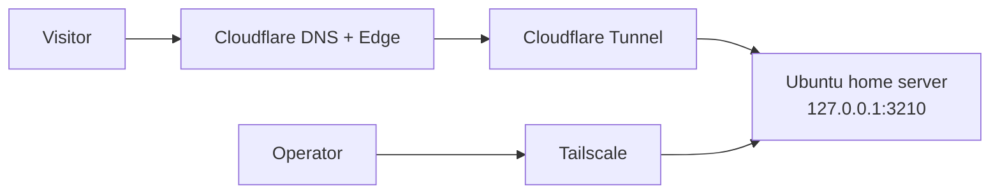

# Cloudflare Domain Setup Runbook For `damit.kr`

Date: 2026-03-26
Owner: PM

## PM goal

Take the product from:

- local / trusted self-host only

to:

- clean public URL on `damit.kr`
- no raw router port-forwarding
- same app still running on the Ubuntu home server

This runbook assumes:

- the app is already working on the Ubuntu host
- Docker Compose runtime is already healthy
- local app port remains `3210`
- Tailscale stays in place for operator access

## Architecture target



## Canonical hostname plan

Use these hostnames:

- product root: `damit.kr`
- preview before cutover: `preview.damit.kr`
- redirect only: `www.damit.kr`
- mail sender domain later: `updates.damit.kr`

## Phase 1. Put DNS on Cloudflare

### Case A. If you bought the domain inside Cloudflare Registrar

You can skip the nameserver transfer step.
Go straight to:

- confirm the zone exists in Cloudflare

### Case B. If you bought the domain somewhere else

Do this first:

1. Log in to Cloudflare
2. Add site / add domain: `damit.kr`
3. Cloudflare will show 2 nameservers
4. Go back to your registrar
5. Replace the existing nameservers with the Cloudflare nameservers
6. Wait until Cloudflare shows the zone as active

Do not continue until the zone is active.

## Phase 2. Prepare DNS structure

Once `damit.kr` is active on Cloudflare:

1. Do **not** point `damit.kr` to the home server yet
2. First create only:
   - `preview.damit.kr`

We want preview first because:

- auth cookies
- login flow
- confirm links
- account/admin/ops surfaces

all need a real hostname test before the root is promoted.

## Phase 3. Install Cloudflare Tunnel on Ubuntu

### Step 1. Install `cloudflared`

On Ubuntu:

1. Install `cloudflared` using Cloudflare's official package instructions
2. Confirm:
   - `cloudflared --version`

### Step 2. Create a tunnel

PM recommendation:

- use a remotely-managed tunnel

Suggested tunnel name:

- `damit-home`

In the Cloudflare dashboard:

1. Go to Zero Trust or Tunnel management
2. Create a tunnel
3. Choose `cloudflared`
4. Name it `damit-home`
5. Choose Linux
6. Copy the installation command

### Step 3. Run the install command on Ubuntu

This typically:

- authenticates the host to Cloudflare
- installs the tunnel token
- installs `cloudflared` as a service

After running it, confirm:

- `systemctl status cloudflared`

The service should be running.

## Phase 4. Publish the preview hostname

In the Cloudflare tunnel dashboard:

1. Add a public hostname
2. Hostname:
   - `preview`
3. Domain:
   - `damit.kr`
4. Service type:
   - `HTTP`
5. URL:
   - `http://127.0.0.1:3210`

Cloudflare docs say the dashboard will automatically create the DNS record pointing the hostname at the tunnel target.

### Expected result

The app should now be reachable at:

- `https://preview.damit.kr`

## Phase 5. Update app environment for preview

On the Ubuntu server, update the self-host `.env` values.

Recommended preview values:

```env
APP_BASE_URL=https://preview.damit.kr
TRUSTED_ORIGINS=https://preview.damit.kr
NODE_ENV=production
AUTH_ENFORCE_TRUSTED_ORIGIN=true
AUTH_DEBUG_LINKS=true
STORAGE_ENGINE=SQLITE
OBJECT_STORAGE_PROVIDER=LOCAL_VOLUME
MAIL_PROVIDER=FILE
```

Why keep `AUTH_DEBUG_LINKS=true` for preview:

- mail cutover is still on hold
- preview is where we validate the real hostname first

### Restart the app

After `.env` changes:

- redeploy or restart the Docker Compose app

## Phase 6. Preview smoke checklist

Now test all of these on `https://preview.damit.kr`:

1. landing
2. login
3. home
4. app
5. ops
6. account
7. admin
8. customer confirmation link

### Minimum acceptance

- page loads over HTTPS
- login flow still works on the preview hostname
- session cookie works
- trusted-origin writes work
- account/admin/ops are reachable after login
- confirm link still works

## Phase 7. Create the root route

Only after preview is good:

In Cloudflare Tunnel, add another public hostname:

- hostname: `@` or root
- domain: `damit.kr`
- service: `http://127.0.0.1:3210`

Depending on UI, this may appear as:

- `damit.kr`

## Phase 8. Configure `www` redirect

After root is working:

1. Prefer a Cloudflare redirect from:
   - `https://www.damit.kr/*`
2. To:
   - `https://damit.kr/${1}`
3. Status:
   - `301`

Product safeguard:

- the app also redirects `www.damit.kr` to `damit.kr`
- this keeps one canonical origin even if `www` is still mapped to the app temporarily

Cloudflare supports `www -> apex` redirects through redirect rules / bulk redirects.

## Phase 9. Promote runtime from preview to root

Update the Ubuntu app `.env` again:

```env
APP_BASE_URL=https://damit.kr
TRUSTED_ORIGINS=https://damit.kr
```

Keep:

```env
AUTH_ENFORCE_TRUSTED_ORIGIN=true
AUTH_DEBUG_LINKS=true
```

Then restart or redeploy the app.

## Phase 10. Root-domain smoke checklist

Test:

- `https://damit.kr/`
- `https://damit.kr/login`
- authenticated flow
- `/home`
- `/app`
- `/ops`
- `/account`
- `/admin`
- a real `/confirm/:token`
- `https://www.damit.kr` redirects to root

## Phase 11. Prepare mail sender domain

Do not cut over yet.

First create:

- `updates.damit.kr`

This is for later:

- Resend sender verification
- `MAIL_FROM=login@updates.damit.kr`

Do not switch mail provider until:

- the sender domain is verified

## Phase 12. What stays unchanged for now

Keep these as-is for now:

- SQLite
- local uploads
- Tailscale operator access
- GitHub Actions self-host deploy

Do **not** add these yet unless there is a clear need:

- router port-forwarding
- public SSH exposure
- Postgres cutover
- live mail cutover

## Phase 13. What comes next after domain cutover

After `damit.kr` is stable on Cloudflare:

1. observe a few days of real usage
2. if external beta expands, prepare Supabase Postgres
3. after DB cutover, prepare Cloudflare R2
4. after sender-domain verification, resume Resend live login

## Exact checklist

### Today

- [ ] Confirm whether the domain is already on Cloudflare or needs nameserver transfer
- [ ] Activate the `damit.kr` zone on Cloudflare
- [ ] Install `cloudflared` on Ubuntu
- [ ] Create tunnel `damit-home`
- [ ] Publish `preview.damit.kr -> http://127.0.0.1:3210`
- [ ] Set `APP_BASE_URL` and `TRUSTED_ORIGINS` to `https://preview.damit.kr`
- [ ] Smoke test preview

### After preview succeeds

- [ ] Publish root `damit.kr -> http://127.0.0.1:3210`
- [ ] Add `www -> root` redirect
- [ ] Set `APP_BASE_URL=https://damit.kr`
- [ ] Set `TRUSTED_ORIGINS=https://damit.kr`
- [ ] Smoke test root

### Later

- [ ] Create `updates.damit.kr`
- [ ] Verify sender domain in Resend
- [ ] Reopen live mail cutover
- [ ] Prepare Supabase Postgres for broader public beta

## Sources

- [Cloudflare Tunnel overview](https://developers.cloudflare.com/tunnel/)
- [Cloudflare Tunnel routing](https://developers.cloudflare.com/tunnel/routing/)
- [Cloudflare remotely-managed tunnel configuration](https://developers.cloudflare.com/cloudflare-one/connections/connect-networks/configure-tunnels/remote-management/)
- [Cloudflare redirecting www to apex](https://developers.cloudflare.com/pages/how-to/www-redirect/)
