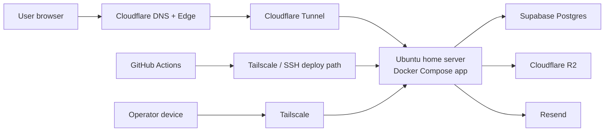

# Cloudflare-Centered Operations Blueprint

Date: 2026-03-26
Owner: PM

## PM verdict

- trusted self-host runtime on the home Ubuntu server: `GO`
- small external beta through Cloudflare without raw router port-forwarding: `GO`
- broad public production on the current home-server stack: `HOLD`

This blueprint answers:

1. what to use now
2. what to keep on the home server
3. what to move out to managed infrastructure
4. how to operate the product from domain purchase to daily operations

## 1. Recommended stack

### Canonical operating stack

| Concern | Recommended choice | Why this is the best fit now |
| --- | --- | --- |
| Domain + DNS | Cloudflare | gives DNS, Tunnel, and edge controls in one place |
| Public entry | Cloudflare Tunnel | avoids direct inbound router port-forwarding |
| Private admin/server access | Tailscale | strongest trusted-access path for SSH and internal operations |
| App runtime | current Ubuntu home server + Docker Compose | already working and keeps compute cost low |
| Database | Supabase Postgres | externalizes state safely while keeping the current app architecture |
| File storage | Cloudflare R2 | best fit for uploads, evidence files, and backup bundles |
| Mail delivery | Resend | already prepared in the app and fits magic-link flow |
| Error monitoring | Sentry | matches the current readiness direction |
| Deploy | GitHub Actions -> Tailscale/SSH -> Docker Compose | already implemented and proven |

## 2. PM recommendation by phase

### Phase A. Today: trusted private or small pilot

Use this without large refactors:

- Cloudflare-managed domain
- Cloudflare Tunnel to the Ubuntu app port
- home Ubuntu server keeps running the app
- SQLite stays local
- uploads stay on local disk
- Tailscale remains the only SSH/admin access path

This is the lowest-cost stable mode if:

- traffic is still light
- paying customers are not yet depending on uptime guarantees
- you want public URLs without exposing raw router ports

### Phase B. Recommended public beta target

Before calling it a real public beta, move stateful dependencies out of the house:

- app compute: still on the home server
- public entry: Cloudflare Tunnel
- database: Supabase Postgres
- uploads/evidence files: Cloudflare R2
- login mail: Resend with verified sender domain

This is the best compromise because:

- compute cost stays low
- the most sensitive state leaves the house
- DB corruption and disk-loss blast radius are reduced
- moving app compute later becomes much easier

### Phase C. Later public production

When uptime expectations become real:

- keep Cloudflare as the front door
- keep managed Postgres
- keep R2 for files
- consider moving app compute from the home server to a VPS or managed container platform

PM judgment:

- do not force this move now
- do it only when uptime, support pressure, or paying customers justify it

## 3. What to use and what to avoid

### Use

- Cloudflare DNS + Tunnel
- Tailscale for operator access
- Supabase Postgres for external state
- Cloudflare R2 for object storage
- Resend for magic-link delivery

### Avoid by default

- direct router port-forwarding to the app
- keeping the primary database on the home server after public beta begins
- relying on home-disk uploads forever
- moving to Cloudflare D1 right now

### Why not Cloudflare D1 right now

This is an inference from the current codebase, not a Cloudflare limitation.

The app is already built around:

- Node.js on a normal server runtime
- repository parity for SQLite and Postgres
- session-heavy auth and relational workflow logic

Moving to D1 would not be a simple hosting swap. It would be a platform migration.
PM recommendation: keep the current server model and use managed Postgres instead.

## 4. Canonical domain structure

## PM recommendation

Use a single canonical product origin first.

Recommended:

- `https://yourdomain.com` -> the whole product
- `https://www.yourdomain.com` -> 301 redirect to the canonical origin
- `updates.yourdomain.com` -> Resend sender domain only

Why this matters:

- current auth cookies are host-scoped
- `login`, `home`, `app`, `ops`, `account`, `admin`, and `confirm` currently work best on one origin
- splitting public and app surfaces across multiple subdomains would require more cookie-domain and host-routing work

### Practical hostname plan

| Hostname | Purpose |
| --- | --- |
| `yourdomain.com` | landing, login, home, app, ops, account, admin, confirm |
| `www.yourdomain.com` | redirect only |
| `updates.yourdomain.com` | Resend sender-domain verification |
| `assets.yourdomain.com` | optional future R2 custom domain |

## 5. End-to-end target architecture

## 6. Operational sequence from 1 to finish

### Step 1. Buy the domain

Best option:

- Cloudflare Registrar when the TLD is supported

Fallback:

- buy anywhere you want, but still move the DNS zone to Cloudflare

## Step 2. Put DNS on Cloudflare

Create:

- apex/root record for the product origin
- `www` redirect to the apex
- later `updates` for mail

## Step 3. Keep the app on the Ubuntu home server

Continue using:

- Docker Compose
- current app container
- health checks
- GitHub Actions deploy

Do not expose the raw app port on the router.

## Step 4. Publish the app through Cloudflare Tunnel

Use Cloudflare Tunnel on the Ubuntu server and point the canonical hostname to the local app port.

Recommended local target:

- `http://127.0.0.1:3210`

This keeps:

- no inbound router port-forward required
- cleaner public URL
- better edge posture than direct exposure

## Step 5. Keep Tailscale for operator access

Even after Cloudflare is added:

- keep SSH on Tailscale
- keep server maintenance on Tailscale
- keep emergency access independent from the public domain

PM judgment:

- Cloudflare is the public door
- Tailscale is the operator door

## Step 6. Move the database out first

When the product shifts from trusted pilot to public beta:

- create a Supabase project
- connect using `DATABASE_URL`
- validate with the existing Postgres preflight path
- move runtime from SQLite to Postgres only after a successful smoke and restore rehearsal

Why database first:

- this reduces the highest-risk home-server state early
- it already matches the current repository direction
- it makes later compute migration easier

## Step 7. Move uploads and evidence files to R2

Target storage model:

- confirmation evidence
- field-record photos
- backup bundles

PM recommendation:

- if no R2 adapter is cut over yet, keep local volume temporarily
- start by copying backup bundles off-host
- then implement and cut over to R2 for real object storage

## Step 8. Enable real mail only after the sender domain is verified

Use:

- Resend
- sender domain: `updates.yourdomain.com`
- `MAIL_FROM` like `login@updates.yourdomain.com`

Do not cut over before verification succeeds.

## Step 9. Add security at the public edge

Recommended sequence:

1. keep Cloudflare Tunnel
2. keep SSH private through Tailscale
3. keep app auth/session protections on
4. add Cloudflare Turnstile on exposed login or invite flows when abuse becomes a concern
5. add edge and app rate limiting before broad public launch

## Step 10. Backups and restore drills

### While still on SQLite

- nightly SQLite backup
- nightly uploads backup
- copy backup bundles off-host

### After Postgres cutover

- rely on managed database backups from the provider
- add scheduled logical dumps for portability
- store dumps or backup manifests off-host, ideally in R2

### Restore rule

- restore rehearsal must be repeated after every major storage or DB transition

## Step 11. Monitoring

Recommended baseline:

- Sentry for application errors
- an external uptime monitor for the public URL
- structured logs with `requestId`, `companyId`, `userId`, `jobCaseId`

PM note:

- do not rely only on local container logs once the service is public

## Step 12. Release and rollback

Keep the current deployment discipline:

- GitHub Actions for deploy
- release-based deploy for controlled versions
- health check after deploy

Add:

- rollback note per release
- known-good image or commit reference
- restore drill note after DB/storage cutovers

## 7. Best operating model for this exact project

### What I recommend right now

If you want the best balance of cost, safety, and realism:

1. buy the domain
2. move DNS to Cloudflare
3. publish the existing home-server app through Cloudflare Tunnel
4. keep SSH and admin access on Tailscale
5. keep SQLite only while access is still trusted and limited
6. before broader public beta, move DB to Supabase Postgres
7. after that, move uploads/backups to R2
8. only then reopen the live mail cutover track

## 8. PM final recommendation

The long-term winning pattern is not "everything at home" and not "everything fully managed".
It is a hybrid:

- Cloudflare for public edge
- home server for cheap compute while traffic is still small
- managed Postgres for durable relational state
- R2 for files
- Resend for login mail
- Tailscale for private operator access

That gives the project:

- low cost now
- safer state management
- an easier migration path later
- much better public-operating posture than raw home-server exposure

## Sources

- [Cloudflare Tunnel](https://developers.cloudflare.com/cloudflare-one/networks/connectors/cloudflare-tunnel/)
- [Cloudflare Registrar](https://developers.cloudflare.com/registrar/)
- [Cloudflare R2 presigned URLs](https://developers.cloudflare.com/r2/api/s3/presigned-urls/)
- [Cloudflare Turnstile get started](https://developers.cloudflare.com/turnstile/get-started/)
- [Supabase: connecting to Postgres](https://supabase.com/docs/guides/database/connecting-to-postgres)
- [Supabase: backups](https://supabase.com/docs/guides/platform/backups)
- [Supabase: billing](https://supabase.com/docs/guides/platform/billing-on-supabase)
- [Resend: managing domains](https://resend.com/docs/dashboard/domains/introduction)
