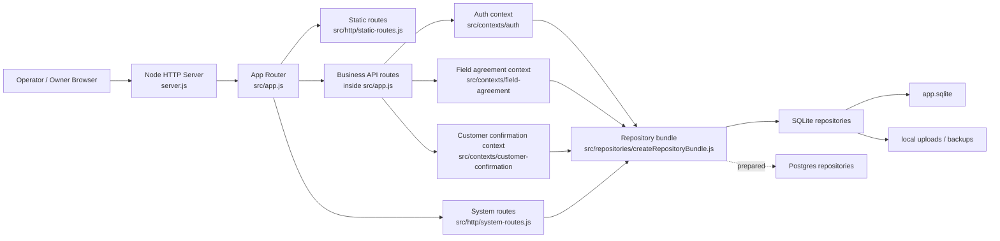
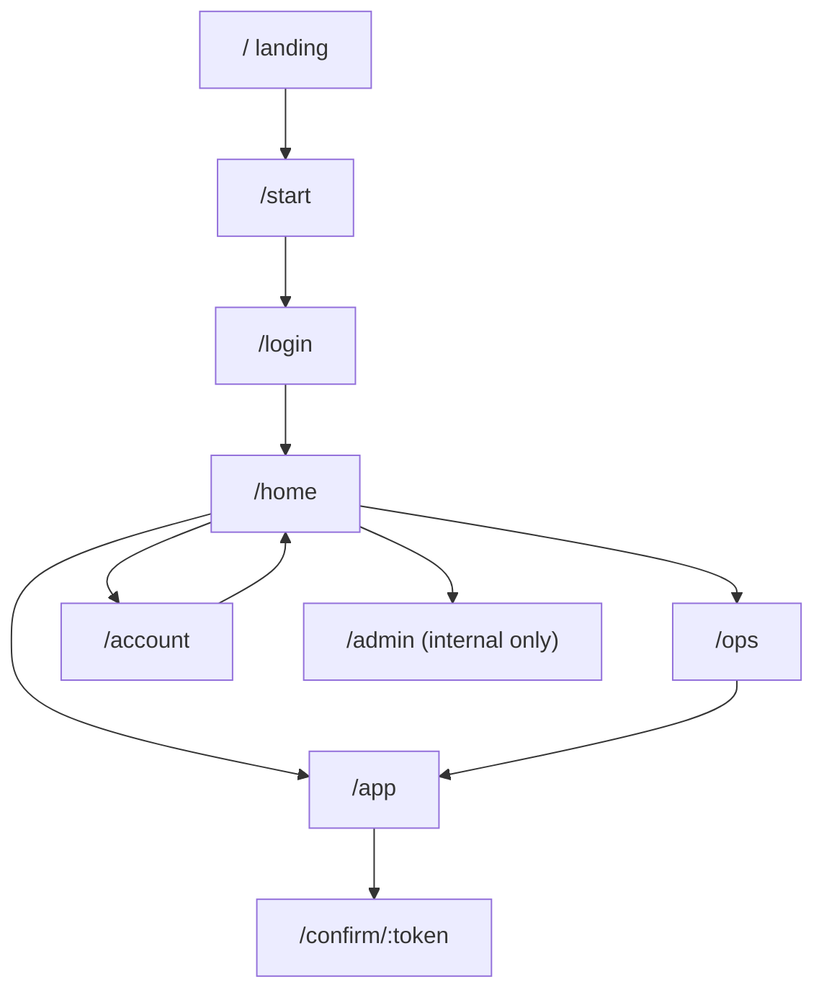
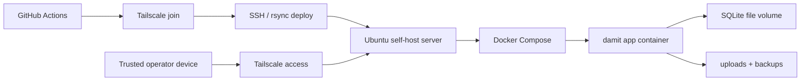

# System Architecture Overview

Date: 2026-03-26
Owner: PM

## PM verdict

- local operational build: `GO`
- self-host trusted environment: `GO`
- public production cutover: `HOLD`
- real mail cutover: `HOLD`

This document describes:

1. what the project is built with today
2. what is actually used in the recommended operating mode
3. what is prepared but intentionally not cut over yet

## 1. Current stack at a glance

| Layer | Current choice | Notes |
| --- | --- | --- |
| Runtime | Node.js ESM | `package.json` uses `"type": "module"` |
| HTTP server | Node built-in `http` | entrypoint is `server.js` |
| API routing | custom app/router layer | `src/app.js`, `src/http/*.js` |
| Frontend | vanilla HTML/CSS/JS | pages live under `public/` |
| Product structure | DDD-lite modular monolith | `src/contexts/*` |
| Main contexts | `field-agreement`, `auth`, `customer-confirmation` | core product boundaries |
| Default database | SQLite | current recommended local and self-host mode |
| Prepared external DB | Postgres | repository parity and migration path are prepared |
| Data access | repository bundle pattern | `src/repositories/*` |
| File storage | local volume abstraction | `LOCAL_VOLUME`, object storage abstraction exists |
| Auth | magic-link challenge + session cookies + CSRF | real mail cutover is still on hold |
| Ops/admin | owner ops + internal system admin surfaces | `/ops`, `/admin`, `/account` |
| Testing | Node-based regression tests | `tests/*.test.js` |
| Visual QA | scripted authenticated visual review | `scripts/visual-review.mjs` |
| Self-host deploy | Docker Compose + GitHub Actions + Tailscale | trusted private environment |
| Public SaaS infra | prepared, not cut over | Postgres and live mail remain hold items |

## 2. Languages and tools in this project

### Core implementation

- JavaScript
  - backend: `server.js`, `src/**/*.js`
  - frontend: `public/**/*.js`
- HTML
  - screen surfaces: `public/*.html`
- CSS
  - shared design system and product UI: `public/styles.css`
- Markdown
  - PM, architecture, QA, rollout, and design docs under `docs/`
- SQL
  - Postgres migrations under `src/db/migrations/postgres/`

### Runtime and package tools

- Node.js
- `pg`
  - prepared Postgres runtime and preflight path
- npm scripts
  - local runtime, tests, smoke flows, migrations, seed/reset

### Delivery and ops tools

- GitHub Actions
  - CI
  - self-host deploy
  - self-host release deploy
- Docker / Docker Compose
  - self-host Ubuntu deployment
- Tailscale
  - trusted access to the self-host runtime
- SQLite
  - current default operational store
- Postgres
  - prepared future external database target
- Resend
  - prepared live mail provider path, not cut over yet

### Design and product workflow tools

- Stitch AI
  - visual exploration and design handoff references
- Recraft / nanobanana2
  - logo exploration
- Codex multi-agent workflow
  - Brainstorm -> PRD -> UX -> Spec -> Implementation -> QA

## 3. Recommended operating mode today

The recommended mode today is:

- local or self-host Ubuntu runtime
- SQLite storage
- local uploads on disk
- session login
- trusted access via local machine or Tailscale

This is the best balance of:

- speed
- cost
- operational simplicity
- evidence-backed reliability

## 4. Current runtime architecture

## 5. Frontend surface map

## 6. Context and module structure

### Entrypoints

- `server.js`
- `src/app.js`

### HTTP layer

- `src/http.js`
- `src/http/static-routes.js`
- `src/http/system-routes.js`

### Bounded contexts

- `src/contexts/field-agreement`
  - scope comparison
  - draft generation
  - job case status rules
  - workflow validation
- `src/contexts/auth`
  - session cookies
  - CSRF
  - magic-link challenge verification
  - company context switching
  - invitations and account security
- `src/contexts/customer-confirmation`
  - confirmation link issuance
  - public confirmation read/acknowledge
  - confirmation event records

### Data and storage layer

- `src/repositories/`
  - runtime abstraction
- `src/repositories/sqlite/`
  - current default implementation
- `src/repositories/postgres/`
  - prepared parity path
- `src/store.js`
  - SQLite runtime helpers and ops snapshot assembly
- `src/object-storage/`
  - object key rules and local-volume adapter

### Product surfaces

- `public/landing.html`
- `public/start.html`
- `public/login.html`
- `public/home.html`
- `public/index.html` (`/app`)
- `public/ops.html`
- `public/account.html`
- `public/admin.html`
- `public/confirm.html`

## 7. Self-host architecture

## 8. What we are using now vs what we are preparing

| Concern | Using now | Prepared next | PM status |
| --- | --- | --- | --- |
| Database | SQLite | Postgres | prepared, not cut over |
| Mail login delivery | file/debug path | Resend live delivery | hold until verified sender domain |
| Hosting | local + self-host Ubuntu | later public production runtime | hold |
| File storage | local disk | object storage provider | partially abstracted, not cut over |
| Access | local browser + Tailscale trusted access | broader public product access | hold |

## 9. What we should keep using

### Keep as the default for now

- Node.js custom server
- vanilla frontend
- DDD-lite context split
- repository bundle pattern
- SQLite for local and self-host trusted runtime
- GitHub Actions self-host deploy
- Tailscale for trusted access

### Use next when the gating condition is met

- Postgres
  - when staging/runtime cutover evidence is needed
- Resend live mail
  - when verified sender domain is ready
- object storage
  - when file scale or public delivery requirements justify the extra complexity

## 10. PM direction from here

The project is no longer in "idea prototype" shape.
It is now a real operational product in a trusted environment.

The best next direction is not more infrastructure first.
It is:

1. sharper operational prioritization in `/ops`
2. clearer reason-to-act continuity into `/app`
3. better operational visibility of live data
4. public production cutover only after evidence, not by assumption

## 11. Reference files

- `server.js`
- `src/app.js`
- `src/config.js`
- `src/http/static-routes.js`
- `src/http/system-routes.js`
- `src/repositories/createRepositoryBundle.js`
- `src/store.js`
- `src/object-storage/createObjectStorage.js`
- `.github/workflows/ci.yml`
- `.github/workflows/self-host-deploy.yml`
- `.github/workflows/self-host-release-deploy.yml`
- `deploy/homelab/docker-compose.yml`
